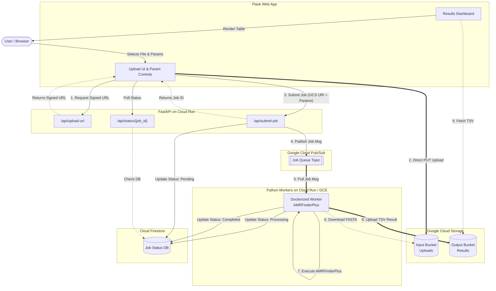

# AMRFinderPlus Cloud-Native Architecture

```mermaid
flowchart TD
    User([User / Browser])
    
    subgraph Frontend [Flask Web App]
        UI[Upload UI & Param Controls]
        Dashboard[Results Dashboard]
    end
    
    subgraph Backend [FastAPI on Cloud Run]
        API_Upload["/api/upload-url"]
        API_Submit["/api/submit-job"]
        API_Status["/api/status/{job_id}"]
    end
    
    subgraph GCP_Storage [Google Cloud Storage]
        BucketIn[(Input Bucket\nUploads)]
        BucketOut[(Output Bucket\nResults)]
    end
    
    subgraph GCP_PubSub [Google Cloud Pub/Sub]
        Queue[[Job Queue Topic]]
    end
    
    subgraph Workers [Python Workers on Cloud Run / GCE]
        Worker[Dockerized Worker\nAMRFinderPlus]
    end
    
    subgraph GCP_DB [Cloud Firestore]
        DB[(Job Status DB)]
    end

    %% Flow steps
    User -->|Selects File & Params| UI
    UI -->|1. Request Signed URL| API_Upload
    API_Upload -.->|Returns Signed URL| UI
    
    UI == 2. Direct PUT Upload ==> BucketIn
    
    UI -->|"3. Submit Job (GCS URI + Params)"| API_Submit
    API_Submit -->|Update Status: Pending| DB
    API_Submit -->|4. Publish Job Msg| Queue
    API_Submit -.->|Returns Job ID| UI
    
    Queue == 5. Pull Job Msg ==> Worker
    Worker -->|Update Status: Processing| DB
    Worker -.->|6. Download FASTA| BucketIn
    
    Worker -->|7. Execute AMRFinderPlus| Worker
    
    Worker == 8. Upload TSV Result ==> BucketOut
    Worker -->|Update Status: Completed| DB
    
    UI -->|Poll Status| API_Status
    API_Status -.->|Check DB| DB
    
    Dashboard -.->|9. Fetch TSV| BucketOut
    Dashboard -->|Render Table| User
```
